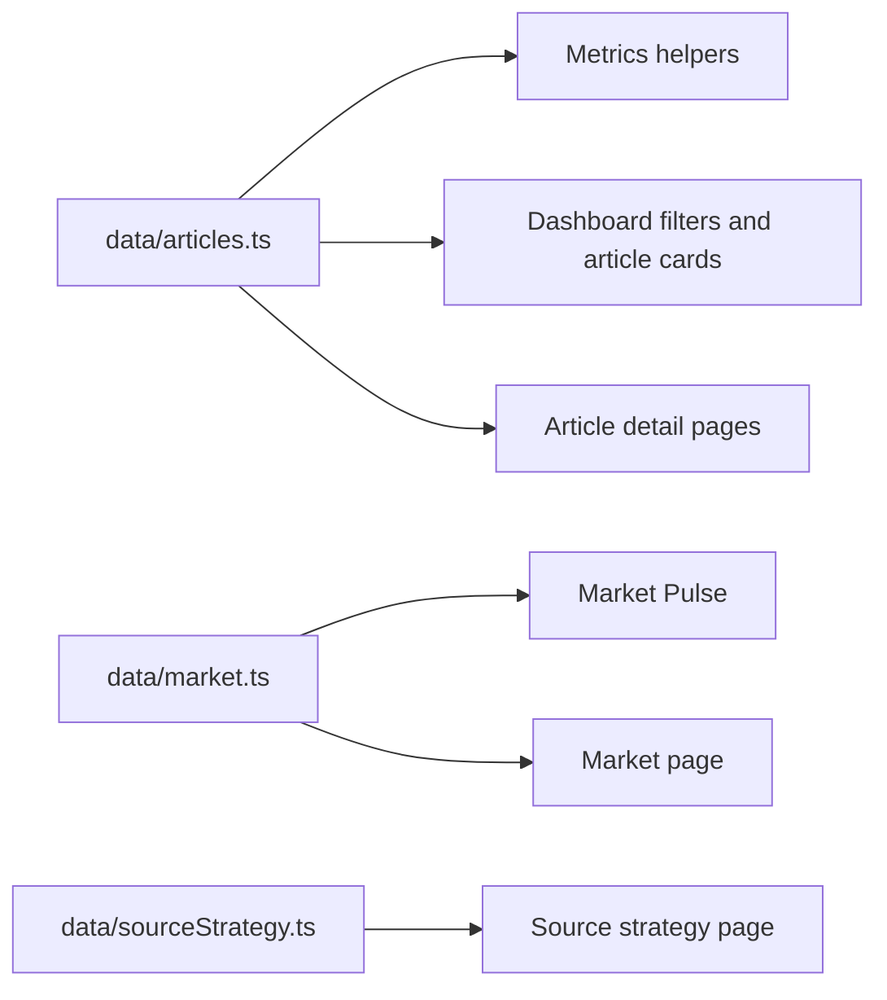
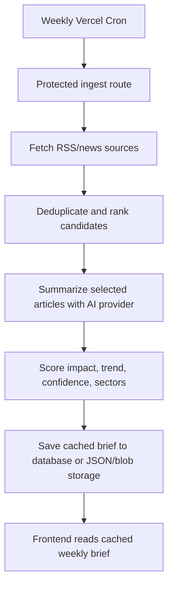

# LoreEngine Architecture

## App Structure

LoreEngine is a Next.js App Router project.

```text
app/
  api/admin/market-refresh/route.ts
  api/admin/weekly-ingest/route.ts
  api/health/route.ts
  api/market/route.ts
  articles/[slug]/page.tsx
  market/page.tsx
  methodology/page.tsx
  sources/page.tsx
  robots.ts
  sitemap.ts
  page.tsx
components/
  ArticleCard.tsx
  ExecutiveBrief.tsx
  IntelligenceDashboard.tsx
  MarketPulse.tsx
  SignalConstellation.tsx
data/
  articles.ts
  market.ts
lib/
  format.ts
  futurePipeline.ts
  marketData.ts
  metrics.ts
```

## Main Components

- `IntelligenceDashboard`: home dashboard composition, filtering, sorting, and top-level state.
- `ArticleCard`: compact story card with impact, trend, sectors, and actions.
- `ExecutiveBrief`: higher-level summary of the most important signals.
- `MarketPulse`: compact market snapshot and link into the larger market view.
- `SignalConstellation`: visual relationship layer for sector/category signals.

## Data Flow Today



The current portfolio build is static/cached:

- Article intelligence is stored locally.
- Market quote snapshots are stored locally.
- Filtering and sorting happen in the client experience.
- No browser route calls a paid AI API.
- No page load triggers summarization.
- `/api/health` exposes a lightweight operational status payload for deployment checks.

## Future Weekly AI Pipeline



The future design ties AI cost to article volume, not visitor traffic.

## Deployment

- **Vercel:** preferred deployment target for the full Next.js app and future cron route.
- **GitHub Pages:** static portfolio mirror through `.github/workflows/pages.yml`.
- **No required environment variables** for the current demo.
- **Optional variable:** `CRON_SECRET` for protecting scheduled admin refresh routes.

## External Services And APIs

Current version:

- No live news API.
- Vercel can refresh weekly market close-price data through `/api/market`.
- `/sources` explains source selection rules, cadence, and source tiers without crowding the dashboard.
- No AI API.
- No database.

Future version:

- RSS/news sources for article collection.
- AI provider for once-per-week summarization.
- Database, object storage, or JSON cache for generated briefs.
- Optional paid/licensed quote provider if the market module needs production-grade coverage.

## Tradeoffs

- Local mock data makes the demo fast and reliable but limits real-world freshness.
- Static deployment is simple for sharing, while Vercel unlocks scheduled server functionality later.
- Weekly close-price refresh is useful for context but is not real-time financial data.
- Scores are useful for product storytelling but need calibration with real editorial review.
- Keeping AI out of the browser improves cost control, privacy, and security.

## Limitations

- Not a production news ingestion system yet.
- Not a financial data product.
- Source freshness and citation quality depend on future ingestion work.
- The AI pipeline scaffold is intentionally non-operational until real provider keys and storage are chosen.
